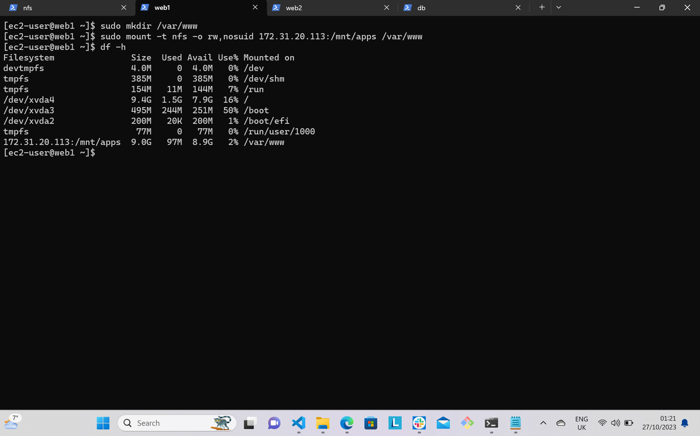

# DevOps Tooling Website Solution

## Prerequisites
For this project, you need to have your 3-Tier web application architecture with a single database and an NFS Server as a shared files storage:
- A laptop or PC that will serve as a client.
- An EC2 instance with RedHat as the AMI (This will serve as NFS server).
- Three EC2 instances with RedHat as the AMI (This will serve as web servers).
- An EC2 instance with Ubuntu as the AMI (This will serve as Database server).

## Implementing a buisness website using NFS for the backend file storage

**Step 1 - Prepare NFS Server**

1. Spin up an EC2 instance using RedHat as the AMI.

2. Create 3 volumes in the same availability zone as your Web ServerEC2, each of 10 GIB. To do this follow these steps:

    - Go to your EC2 dashboard and click on volumes which is listed under Elastic Block Store.
    - Click on create volume
    - Change the size to 10 GIB and the availability zone to that of your EC2 instance.
    - Click on create volume.

    
    
    

    3. Attach all the three volumes one at a time to your Web Server EC2 instance. Follow the below steps:

    - Select one volume
    - Right click on it and options will be displayed
    - Select attach volume
    - Select the Web Server instance 
    - Click attach
    - Repeat these steps for the subsequent volumes.

    
    

    4. Connect your Web Server EC2 instance to your terminal through SSH.
    To check which block devices are attached to the server, use the below command:
    ```python
    lsblk
    ```
    

    5. Use gdisk utility to create single partition on each of the 3 disks. Type in this command:

    ```python
    sudo gdisk /dev/xvdf
    ```
    

    6. To view the newly configured partition on each 3 disks, run this command:

    ```python
    lsblk
    ```
    

    7. Install `lvm2` package using this command:
    ```python
    sudo yum install lvm2
    ```
    

    8. To mark each of the 3 disks as physical volumes (PVs) to be used by LVM, use `pvcreate` utility by running the below command respectively:

    ```python
    sudo pvcreate /dev/xvdf1
    sudo pvcreate /dev/xvdg1
    sudo pvcreate /dev/xvdh1
    ```
    

    9. Verify that yoyr Physical volume has been created successfully by running:

    ```python
    sudo pvs
    ```
    

    10. Use `vgcreate` utility to add all 3 PVs to a volume group (VG) and call it *webdata-vg*. Type in the below command:

    ```python
    sudo vgcreate webdata-vg /dev/xvdh1 /dev/xvdg1 /dev/xvdf1
    ```
    Verify it by running `sudo vgs`

    

    11. Create 3 logical volumes using `lvcreate` utility. Name them **lv-opt**, **lv-apps** and **lv-logs**. Type in the below command respectively:

    ```python
    sudo lvcreate -n lv-opt -L 9G webdata-vg
    sudo lvcreate -n lv-apps -L 9G webdata-vg
    sudo lvcreate -n lv-logs -L 9G webdata-vg
    ```
    Verify it by running `sudo lvs`

    

    12. Use the below command to format logical volumes with *xfs* filesystem one at a time.

    ```python
    sudo mkfs -t xfs /dev/webdata-vg/lv-apps
    sudo mkfs -t xfs /dev/webdata-vg/lv-logs
    sudo mkfs -t xfs /dev/webdata-vg/lv-opt
    ```
    

    13. Create mount points on /mnt directory for the logical volumes as follows: 
    - Mount lv-apps on /mnt/apps - To be used by webservers
    - Mount lv-logs on /mnt/logs - To be used by webserver logs
    - Mount lv-opt on /mnt/opt - To be used by Jenkins server for next project.

    Run the below command:

    ```python
    sudo mkdir /mnt/apps
    sudo mkdir /mnt/logs
    sudo mkdir /mnt/opt
    ``` 
    Then run:

    ```python
    sudo mount /dev/webdata-vg/lv-apps /mnt/apps
    sudo mount /dev/webdata-vg/lv-logs /mnt/logs
    sudo mount /dev/webdata-vg/lv-opt /mnt/opt
    ```

    

    14. Install NFS server, configure it to start on reboot and ensure it is running. Type in the below command one after another:

    ```python
    sudo yum -y update
    sudo yum install nfs-utils -y
    sudo systemctl start nfs-server.service
    sudo systemctl enable nfs-server.service
    sudo systemctl status nfs-server.service
    ```
    
    

    15. Export the mounts for webservers *subnet cidr* to connect as clients. To do this, follow the below steps:
    - Open your EC2 for NFS server
    - Click on networking
    - Click on Subnet ID, which will open up subnet page
    - Copy the IPv4 CIDR number
    
    16. Set up permission that will allow our webservers to read, write and execute files on NFS. Run the below command respectively:

    ```python
    sudo chown -R nobody: /mnt/apps
    sudo chown -R nobody: /mnt/logs
    sudo chown -R nobody: /mnt/opt
    ```

    Next, run;

    ```python
    sudo chmod -R 777 /mnt/apps
    sudo chmod -R 777 /mnt/logs
    sudo chmod -R 777 /mnt/opt
    ```

    Then;

    ```python
    sudo systemctl restart nfs-server.service
    ```

    17. Configure access to NFS for clients within the same subnet. Open /etc/exports director with a text editor, type:

    ```python
    sudo vi /etc/exports
    ```
    Paste the below inside the file

    ```python
    /mnt/apps <Subnet-CIDR>(rw,sync,no_all_squash,no_root_squash)
    /mnt/logs <Subnet-CIDR>(rw,sync,no_all_squash,no_root_squash)
    /mnt/opt <Subnet-CIDR>(rw,sync,no_all_squash,no_root_squash)
    ```
    Save and close the file

    18. Export all the directories using the below command:
    
    ```python
    sudo exportfs -arv
    ```
    

    19. Check which port is used by NFS, run:

    ```python
    rpcinfo -p | grep nfs
    ```
    

    20. Go to the NFS EC2 instance and open the listed ports using security group.

    

    ## Configure backend database as part of 3 tier architecture

    **Step 2 - Configure the database server**

    1. Spin up an EC2 instance with Ubuntu as the AMI.

    2. Install MySQL server using this command:

    ```python
    sudo apt install mysql-server -y
    ```
    

    3. log into Mysql console by typing -

    ```python
    sudo mysql
    ```
    4. Create a database and call it `tooling`

    ```python
    create database tooling;
    ```

    5. Create user called 'webaccess' and set a password for the user by typing:

    ```python
    create user 'webaccess'@'nfs subnet cidr' identified by     'your chosen password';
    ```

    6. Grant permission to webaccess user on tooling database to do anything only from the webservers subnet cidr. run:

    ```python
    grant all privileges to tooling.* to 'webaccess'@'nfs subnet cidr';
    ```

    7. Followed by `flush privileges` command.

    8. Type `show databases;` command to confirm.

    9. Type `exit` to close mysql console.

    
    
    **Step 3 - Prepare the Web Servers**

    1. Launch three EC2 instances with RHEL operating system and run all the listed command below on each of them.

    2. Install NFS client using this command:

    ```python
    sudo yum install nfs-utils nfs4-acl-tools -y
    ```
    

    3. Create /var/www directory and mount it targeting NFS servers' export for apps

    ```python
    sudo mkdir /var/www
    sudo mount -t nfs -o rw,nosuid <NFS-Server-Private-IP-Address>:/mnt/apps /var/www
    ```

    Use `df -h` command to verify.

    

    4. Make sure the changes persist on Web Server after reboot. Do the following:

    ```python
    sudo vi /etc/fstab
    ```
    and paste the below inside the file

   <NFS-Server-Private-IP-Address>:/mnt/apps /var/www nfs defaults 0 0

    Save and close file.

    

    5. Install Remi's repository, Apache and PHP. Run the below command simultaneously:

   ```python
    sudo yum install httpd -y
    sudo systemctl start httpd
    sudo systemctl enable httpd
    sudo dnf install https://dl.fedoraproject.org/pub/epel/epel-release-latest-9.noarch.rpm
    sudo dnf install dnf-utils http://rpms.remirepo.net/enterprise/remi-release-9.rpm
    sudo dnf module reset php
    sudo dnf module enable php:remi-7.4
    sudo dnf install php php-opcache php-gd php-curl php-mysqlnd
    sudo systemctl start php-fpm
    sudo systemctl enable php-fpm
    sudo setsebool -P httpd_execmem 1
   ```
    
    
    
    
    
    
    

    6. Verify that Apache files and directories are available on the web server in /var/www and also on NFS server in /mnt/apps. If you see the same files, it means NFS is mounted correctly. Run:

    `ls /var/www` on web server
    `ls /mnt/apps` on NFS server

    
    

    7. Locate the log folder for Apache on the web server and mount it to NFS server's export for logs. Type this command:

    ```python
    sudo mount -t nfs -o rw,nosuid <NFS-Server-Private-IP-Address>:/mnt/logs /var/log/httpd
    ```
    8. Make sure the changes will persist after reboot. Run this command:

    ```python
    sudo vi /etc/fstab
    ```

    and paste the below inside the file

    <NFS-Server-Private-IP-Address>:/mnt/logs /var/log/httpd nfs defaults 0 0

    

    9. Fork the tooling source code from **Darey.io.Github Account** to your github account or webserver. To do this, follow the below steps:
    - Go to the above github account
    - Click on code
    - Copy the https link
    - Install git on your webserver if it's not installed
    - Type in this command to clone the tooling source code `git clone <the github https link>`

    
    
    

    10. Deploy the tooling website's code to the webserver and make sure the *html* folder is deployed to `/var/www/html`
    - cd into tooling folder
    - type in `sudo cp -R html/. /var/www/html`

    

    11. Open TCP port 80 on the webserver.

    12. To avoid 403 error, check permissions to your /var/www/html folder and also disable SELinux. Run:

    ```python
    sudo setenforce 0
    ```
    13. To disable SELinux permanently, open the following config file

    ```python
    sudo vi /etc/sysconfig/selinux
    ```
    set `SELinux=disabled`

    

    Save and close the file.

    14. Restart httpd, run:

    ````python
    sudo systemctl restart httpd
    ````

    15. Update the database configuration. Run this command:

    ```python
    sudo vi /etc/mysql/mysql.conf.d/mysqld.cnf
    ```
    Change the bind address to 0.0.0.0

    Save and close the file.

    

    Restart mysql server using the below commnad:

    ```python
    sudo systemctl resatrt mysql
    ```
    
    16. Update the webserver's configuration to connect to the database in `/var/www/html/functions.php`file and type in the database, user and password you created on your database server. Run the below command:

    ```python
    sudo vi /var/www/html/functions.php
    ```
     
    After editing the file, save and close it.

    17. Apply `tooling-db.sql` script to your database. On your webserver, cd into tooling folder and then use this command:

    ```python
    mysql -h <database-private-ip> -u <db-username> -p <db-password> < tooling-db.sql
    ```
     
     Before you can carry out the above command, install mysql on your webserver using this command : `sudo yum install mysql`

     

     18. Create in MySQL a new admin user. Follow the below steps:
     - On your database server, open mysql console with this command `sudo mysql`
     - Type in this command `use tooling;`
     - Next, run this command `select * from users;`

     19. Open your browser and open your website `http://<Web-Server_Public_IP_Address->/index.php`

     A login page will come up, type in the user name and password you ceated. 

     

     Web Server 1
     

     Web Server 2
     

    Web Server 3
    
